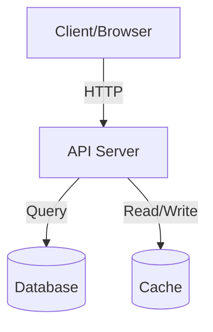
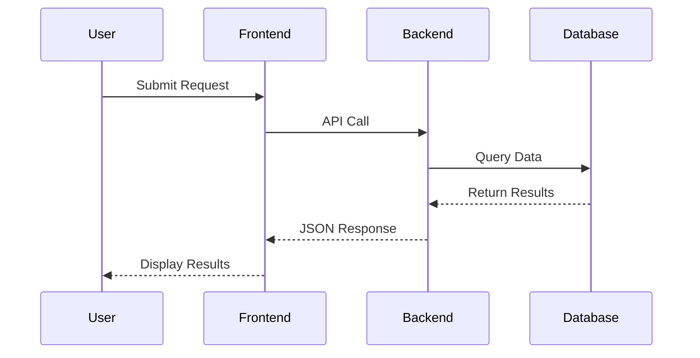
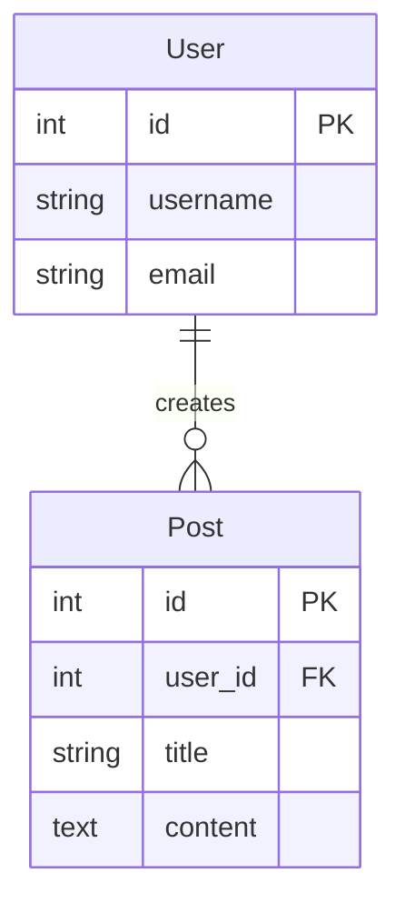

# REVERSE ENGINEERING DOCUMENTATION GENERATOR - COMPLETE WORKFLOW

## CRITICAL MISSION: Execute complete 6-step workflow to analyze GitHub repository and generate comprehensive documentation

GitHub URL, purpose, owner, and repo name are provided in the main prompt. Use those values.

## MANDATORY FIRST ACTION - TodoWrite

Use the TodoWrite tool with this exact structure:
```json
{
  "todos": [
    {"content": "Create todo list for reverse engineering workflow", "status": "pending", "activeForm": "Creating todo list"},
    {"content": "Initialize reverse engineering workflow", "status": "pending", "activeForm": "Initializing workflow"},
    {"content": "Prime: Analyze repository structure and tech stack", "status": "pending", "activeForm": "Analyzing repository"},
    {"content": "Clone: Clone GitHub repository locally", "status": "pending", "activeForm": "Cloning repository"},
    {"content": "Analyze: Deep dive into codebase structure", "status": "pending", "activeForm": "Analyzing codebase"},
    {"content": "Generate: Create all 13 documentation files", "status": "pending", "activeForm": "Generating documentation"},
    {"content": "Format: Format documentation with proper structure", "status": "pending", "activeForm": "Formatting documentation"},
    {"content": "Finalize: Add diagrams and cross-references", "status": "pending", "activeForm": "Finalizing documentation"},
    {"content": "Verify all 13 documentation files generated", "status": "pending", "activeForm": "Verifying output"},
    {"content": "Complete reverse engineering workflow", "status": "pending", "activeForm": "Completing workflow"}
  ]
}
```

## MANDATORY EXECUTION SEQUENCE

Execute these 6 workflow steps in order:

### STEP 1: PRIME - Repository Analysis
**Purpose:** Analyze repository structure and identify tech stack

**Actions:**
1. Parse GitHub URL to extract owner and repository name
2. Use Bash tool to validate Git is available
3. Create analysis plan based on repository type
4. Identify primary programming languages and frameworks
5. Note any special configurations (Docker, CI/CD, etc.)
6. Mark todo as completed

**Example Commands:**
```bash
# Validate git is available
git --version

# Check if repository is accessible
git ls-remote https://github.com/owner/repo.git HEAD
```

### STEP 2: CLONE - Repository Cloning
**Purpose:** Clone the GitHub repository to local directory for analysis

**Actions:**
1. Create temporary directory for cloning (use /tmp or similar)
2. Clone the repository using git clone
3. Verify clone was successful
4. Navigate to repository directory
5. Get basic repository stats (file count, size, etc.)
6. Mark todo as completed

**Example Commands:**
```bash
# Create directory for repository
mkdir -p /tmp/reverse_engineering_workspace
cd /tmp/reverse_engineering_workspace

# Clone repository
git clone https://github.com/owner/repo.git
cd repo

# Get repository stats
git log --oneline | wc -l  # Commit count
find . -type f | wc -l      # File count
du -sh .                     # Repository size
```

### STEP 3: ANALYZE - Codebase Analysis
**Purpose:** Deep analysis of codebase structure, dependencies, and architecture

**Actions:**
1. Identify project structure (directories, key files)
2. Analyze package.json, requirements.txt, or similar dependency files
3. Identify main entry points and key modules
4. Map out component/module relationships
5. Identify API endpoints, routes, or services
6. Analyze database models and schema (if present)
7. Identify frontend components and pages
8. Note any design patterns used
9. Mark todo as completed

**What to Analyze:**
- **Frontend:**
  - Components (React, Vue, Angular, etc.)
  - Pages/Routes
  - State management (Redux, Vuex, etc.)
  - Styling approach (CSS, SCSS, Tailwind, etc.)

- **Backend:**
  - API endpoints and routes
  - Controllers/Handlers
  - Services/Business logic
  - Middleware
  - Database models

- **Configuration:**
  - Environment variables
  - Build configuration
  - CI/CD pipelines
  - Docker/Container setup

- **Dependencies:**
  - Production dependencies
  - Development dependencies
  - Peer dependencies
  - Version constraints

### STEP 4: GENERATE - Documentation Generation
**Purpose:** Create all 13 markdown documentation files

**CRITICAL:** You MUST generate ALL 13 of these files in REVERSE_ENGINEERING_DOCS/ folder

**Actions:**
1. Create REVERSE_ENGINEERING_DOCS directory
2. Generate each documentation file (see list below)
3. Ensure each file has proper structure and content
4. Include code examples where relevant
5. Add tables for structured data
6. Mark todo as completed

**Required Documentation Files:**

#### 1. README.md
- Index of all documentation files
- Quick navigation links
- Project overview summary
- How to use the documentation

#### 2. 01_PROJECT_OVERVIEW.md
- Project name and description
- Primary purpose and goals
- Tech stack summary
- Key technologies used
- Project structure overview
- Repository statistics

#### 3. 02_ARCHITECTURE.md
- System architecture diagram (ASCII or Mermaid)
- Component relationships
- Data flow overview
- Design patterns identified
- Architecture decisions
- Scalability considerations

#### 4. 03_API_DOCUMENTATION.md
- Complete API reference
- All endpoints with HTTP methods
- Request/Response formats
- Authentication/Authorization
- Error handling
- API examples

#### 5. 04_FRONTEND_ANALYSIS.md
- Frontend framework and structure
- Component hierarchy
- Page/Route mapping
- State management approach
- Styling system
- UI/UX patterns

#### 6. 05_BACKEND_ANALYSIS.md
- Backend framework and architecture
- Service layer organization
- Business logic structure
- Middleware stack
- Error handling approach
- Security implementations

#### 7. 06_DATABASE_SCHEMA.md
- Database type and version
- Entity-Relationship diagram (Mermaid)
- Table/Collection schemas
- Relationships and constraints
- Indexes and optimization
- Migration strategy

#### 8. 07_COMPONENTS.md
- Detailed component documentation
- Component props/parameters
- Component usage examples
- Reusable components
- Component dependencies
- Component lifecycle

#### 9. 08_FEATURES.md
- Feature list and descriptions
- User workflows
- Feature implementation details
- Feature dependencies
- Roadmap items (if identified)

#### 10. 09_DEPENDENCIES.md
- Complete dependency list
- Production vs development dependencies
- Version analysis
- Security considerations
- Update recommendations
- Dependency tree overview

#### 11. 10_HOW_IT_WORKS.md
- System flow explanations
- Request/Response lifecycle
- Data flow diagrams
- Integration points
- Third-party service usage
- Processing workflows

#### 12. 11_SETUP_GUIDE.md
- Prerequisites and requirements
- Installation steps
- Configuration instructions
- Environment setup
- Database setup
- Running locally
- Testing instructions
- Troubleshooting tips

#### 13. 12_REVERSE_ENGINEERING_STRATEGY.md
- How to recreate the project
- Key implementation steps
- Critical decisions to make
- Alternative approaches
- Technology substitutions
- Gotchas and challenges

#### 14. 13_WHITE_LABEL_GUIDE.md
- White-labeling strategy
- Customization points
- Branding locations
- Configuration for multi-tenancy
- Theme customization
- Deployment variations

### STEP 5: FORMAT - Documentation Formatting
**Purpose:** Ensure all documentation is properly formatted with consistent structure

**Actions:**
1. Verify all files use proper markdown syntax
2. Add consistent headers and sections
3. Format code blocks with proper syntax highlighting
4. Ensure tables are properly formatted
5. Add internal links between documentation files
6. Verify all lists are properly formatted
7. Mark todo as completed

**Formatting Standards:**
- Use `#` for main title, `##` for sections, `###` for subsections
- Code blocks should specify language: ```javascript, ```python, etc.
- Tables should have header row and alignment
- Internal links: `[Link Text](./FILE.md#section)`
- Lists should be consistent (either `*` or `-`)
- Include blank lines between sections

### STEP 6: FINALIZE - Finalization and Enhancement
**Purpose:** Add visual diagrams, cross-references, and validation

**Actions:**
1. Add Mermaid diagrams for architecture
2. Add Mermaid diagrams for data flow
3. Add Mermaid diagrams for ER schema (if database exists)
4. Add cross-references between related sections
5. Verify all internal links work
6. Add navigation footer to each file
7. Validate all 13 files exist and are complete
8. Generate final summary
9. Mark todo as completed

**Mermaid Diagram Examples:**

**Architecture Diagram:**


**Data Flow Diagram:**


**ER Diagram:**


## DOCUMENTATION OUTPUT STRUCTURE

```
REVERSE_ENGINEERING_DOCS/
├── README.md                              # Index of all docs
├── 01_PROJECT_OVERVIEW.md                 # High-level summary
├── 02_ARCHITECTURE.md                     # System architecture
├── 03_API_DOCUMENTATION.md                # All API endpoints
├── 04_FRONTEND_ANALYSIS.md                # Frontend deep dive
├── 05_BACKEND_ANALYSIS.md                 # Backend deep dive
├── 06_DATABASE_SCHEMA.md                  # Database design
├── 07_COMPONENTS.md                       # Component docs
├── 08_FEATURES.md                         # Feature mapping
├── 09_DEPENDENCIES.md                     # Dependency analysis
├── 10_HOW_IT_WORKS.md                     # System flows
├── 11_SETUP_GUIDE.md                      # Local setup
├── 12_REVERSE_ENGINEERING_STRATEGY.md     # Recreation guide
└── 13_WHITE_LABEL_GUIDE.md                # White-labeling
```

## COMPLETION REQUIREMENTS

YOU MUST:
1. Execute ALL 6 workflow steps in order (Prime → Clone → Analyze → Generate → Format → Finalize)
2. Create ALL 13 markdown documentation files (no exceptions)
3. Include proper markdown formatting
4. Add Mermaid diagrams for visualization
5. Cross-reference between files
6. Verify repository was successfully cloned
7. Update todos as you progress
8. Mark all todos as completed when done

## FORBIDDEN ACTIONS

- Do NOT skip any of the 6 workflow steps
- Do NOT generate fewer than 13 documentation files
- Do NOT skip the cloning step
- Do NOT skip analysis of the actual codebase
- Do NOT use placeholder or fake data
- Do NOT skip Mermaid diagrams
- Do NOT skip cross-references
- Do NOT start next step until previous step is marked completed
- Do NOT skip todo updates

## SUCCESS CRITERIA

- ✓ All 10 todos marked as completed (100% completion)
- ✓ All 6 workflow steps executed successfully (Prime, Clone, Analyze, Generate, Format, Finalize)
- ✓ All 13 markdown documentation files created in REVERSE_ENGINEERING_DOCS/ folder
- ✓ Repository cloned successfully
- ✓ Comprehensive analysis of actual codebase
- ✓ Documentation includes Mermaid diagrams
- ✓ Documentation includes proper cross-references and links
- ✓ README.md serves as a proper index to all other documentation files
- ✓ All files properly formatted with markdown standards

## QUALITY STANDARDS

- All markdown files must be properly formatted with headers, lists, code blocks
- Include at least 3 Mermaid diagrams (architecture, data flow, ER diagram if applicable)
- Include code samples from the actual repository where relevant
- Provide comprehensive coverage of the codebase
- Cross-reference between files using proper markdown links
- Include tables for dependencies, APIs, components, etc.
- Each file should be 200+ lines of comprehensive content
- Use actual code snippets from the repository being analyzed

## REAL-TIME PROGRESS UPDATES

As you work, provide updates like:
- "🔍 Step 1 (Prime): Analyzing repository structure..."
- "📥 Step 2 (Clone): Cloning repository from GitHub..."
- "🔬 Step 3 (Analyze): Deep diving into codebase..."
- "📝 Step 4 (Generate): Creating documentation file 5/13..."
- "✨ Step 5 (Format): Formatting and linking documentation..."
- "🎯 Step 6 (Finalize): Adding diagrams and finalizing..."
- "✅ Complete! All 13 documentation files generated successfully"

START NOW with TodoWrite and execute the complete 6-step reverse engineering workflow.
